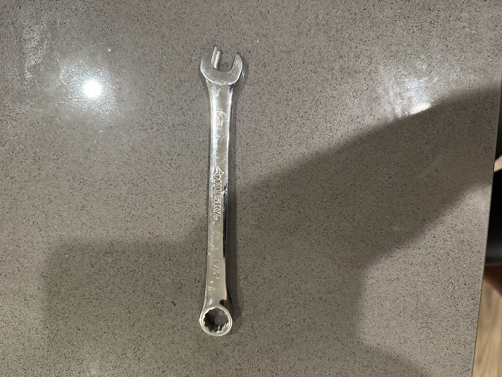

# A1 – [Topic]

## Analyze

### Task A: Portfolio Analysis 

## Portfolio 1: [Sean Ware](https://seanware5.github.io/seanware/index.html)
**Navigability**:
The layout of the portfolio allows the user to find individual engineering projects in under 1 minute. The homepage of this portfolio gives a brief description of the creator and what is in their portfolio. Right below this is 4 pictures that pertain to 4 different projects that include direct links to learn more. The way this portfolio is laid out makes it very easy for potential employers to see certain projects without having to search through tons of pages. 

**Reproducibility**:
Using this portfolio, it would be hard to replicate any of these projects. For example, the Glass Dome Polishing Machine, the user was given a brief description of the project, as well as few videos. In those videos you can clearly see the glass dome polishing machine in action. We also get a rendered video of the motion track of the polisher. We are supplied with no dimensions, no part files, no parts list, no engineering drawings, or any sort of assembly instructions. This same theme continues throughout the rest of the projects. Based on the lack of information provided, specifically the specifications of all parts used, it would be very hard to replicate these projects.

**Evidence of reasoning**:
The creator provides some evidence of engineering reasoning. The creator provides the process that they followed but not why they followed it. There is no reasoning for why he chose one thing over another. It seems the creator is presenting this as a final product rather than a portfolio of what they did to get to this point. What the creator did well at was stating the requirements the project had to fulfill. For example, the Fuel Tank Payload System it stated requirements such as, hold beverage bottle, be removable from the pylon. 

**Professional Tone**:
This creator maintains a professional tone throughout the portfolio by using the correct and current application, equipment, and manufacturing processes names. For Example, the projects reference CAD, 3D Printing, CNC Milling, and the specific manufacturing equipment that was used. However, after rereading I did notice some grammatical errors as well as spelling errors that need to be cleaned up in order to keep the professional tone throughout.

## Portfolio 2: [Alexander Brush](https://alexanderbrush.com/)
**Navigability**:
This portfolio allows for easy navigation for the user to be able to find the creators projects as well as their resumé. Once you go to the projects screen all of the projects are clearly laid out with a photo and the option to click for details. When you view the details of each project there are many different subtitles with brief descriptions about a different part of the project/process. This organization allows a potential employer to be able   to locate specific qualifications and projects under 60 seconds.

**Reproducibility**:
This creator does a very good job at giving the user extensive information on their project. One project included a 108-page PDF that discussed all steps that were taken as well as errors that were made along the way. This was really great because not only could you figure out the right process, but you could also see why the other ones did not work. This provided lots of information to the user and would be pretty helpful to replicate this project.

**Evidence of Reasoning**:
This portfolio is very strong on evidence of reasoning especially because it explains its errors and not only the successful project. This lets the user understand why the decisions were made rather than just seeing the correct answer. In addition to errors, it also shows pivots, and changes that were made throughout the design process. By documenting these incidents during the project, the user can fully understand why something is a specific way.

**Professional Tone**:
This portfolio maintains a formal, employer-appropriate engineering tone throughout its entirety. This is because it uses quantitative results and certain specific technical terminology. For Example, one of the projects refers to ANOVA and Tukey HSD testing and explains how these methods were used to evaluate machining parameters. The results are also quantified, reporting an approximately 33% reduction in tool breakage and an estimated 2.5 million in annual savings. 

### Task B: Product Analysis

#### Product: Husky 1/2-Inch Combination Wrench 
**Primary Function**: 
The primary function of this wrench is to provide the user with a mechanical advantage by transmitting an applied force through the handle to create torque about the rotational axis of a nut or bolt. This allows the fastener to be tightened or loosened.
##### Governing Model

**Equation:**

T = rF sin(θ)

Where:
- **t** torque applied to fastener
- **r** = distance from the rotational axis of the fastener to where the force is applied
- **F** = force applied by the user
- **θ** = angle between the wrench handle and the applied force of the user

When the force is applied optimally (perpendicular) the wrench handle (θ = 90 deg) the equation is simplified to:

T = rF

**Assumption:**
The wrench is assumed to behave as a single rigid body this means deformation of the wrench when force is applied is negligible. 

#### Component and Geometry

The wrench is manufactured as one continuous component. The long handle on this wrench increases the distance between the rotational axis of the fastener and the applied hand force allowing greater torque to be created for an applied force. This wrench has 2 different ends on it allowing it to be used for different applications. On one side, you have a 12-point box end, and on the other side you have an open end. The closed 12-point geometry allows the wrench to engage the fastener from all sides while allowing also allowing engagement from multiple angles. The open-end side allows engagement with the fasteners from the side. Neither side can be used in every situation so putting these 2 on the same tool increases the number of applications in which this wrench can be used.

#### Patent Research 

**Patent:** [US5931066A](https://patents.google.com/patent/US5931066A/en)

**Inventor:** Linn A. Waynick

**Alternative Solutions:**
1. Socket Wrench with ratchet
2. Adjustable Wrench

**Design Decision:**
The design of this wrench is important in maximizing its applications. The handle is sized so that it can be comfortably held by the user's hand while providing enough length to create a mechanical advantage. The closed box end also creates an opening that can be used for storage. One of the most important design decisions was that the open end is angled relative to the handle. I believe this angle was chosen specifically to allow the wrench to be used in confined places. This is because when working in tight spaces the user cannot rotate the wrench at a large angle and has to be repositioned constantly for smaller turns. The angle of the open end relative to the handle can also be seen in the patent schematics. This increases the number of situations in which this wrench can effectively engage fasteners.   
## Decide

### Homepage Identity
I chose to keep the homepage simple and focused on explaining the purpose and organization of my engineering portfolio. The home page clearly states that I will be using the Analyze, Decide and Communicate structure. Below this I have a brief description of each part of the process for a quick refresher for the user and to show what those principles mean to me.  

### Intentional Customization 
I changed the introductory paragraph on the homepage to give a more personalized description of my portfolio. It defines who's work it is as well as it being a work in progress following me throughout the semester. I also note that my work will continue to develop throughout the semester. 

### Documentation 
My documentation standard will be to show not only the engineering decisions I made, but also the reasoning and evidence that led me to make these decisions.

## Communicate

