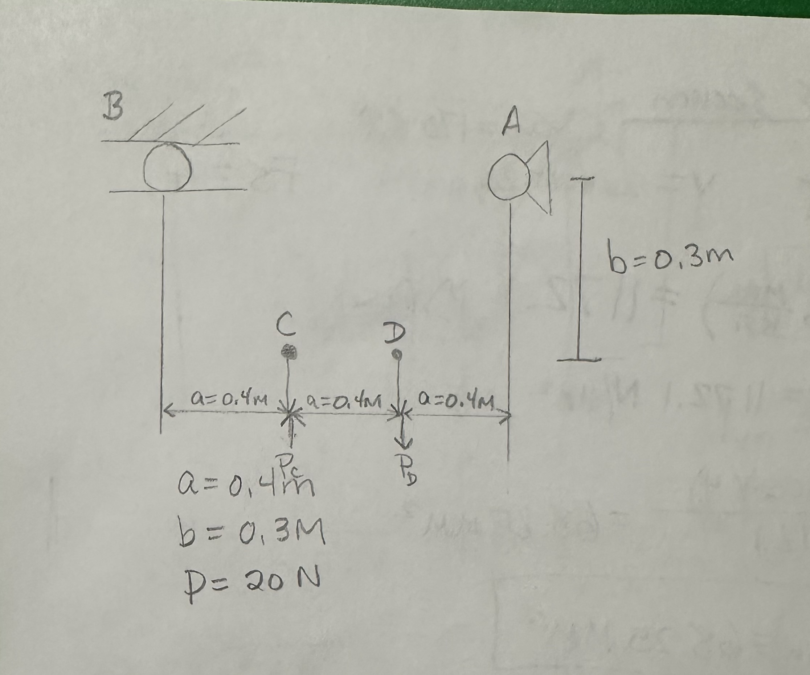
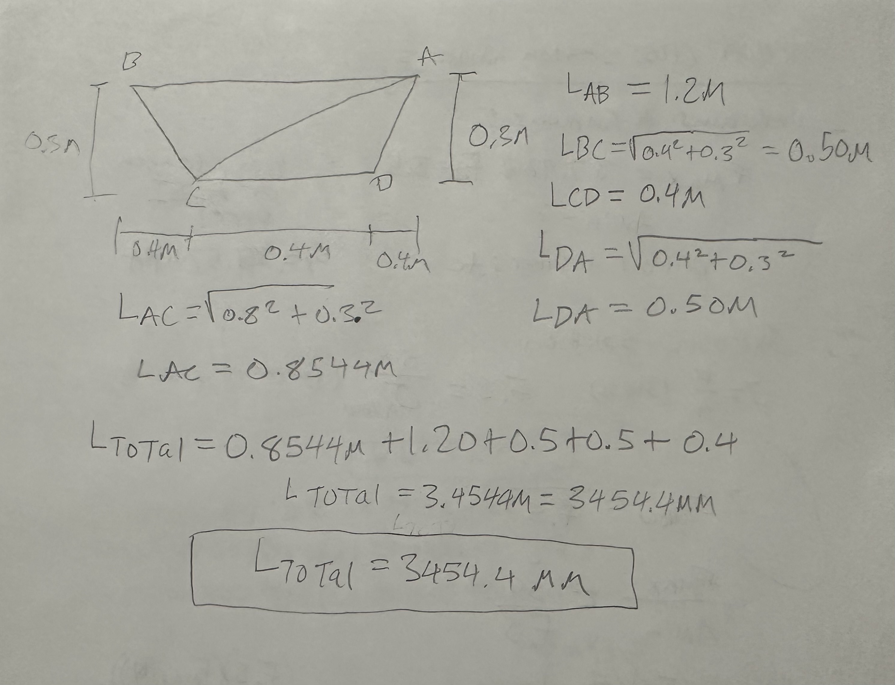
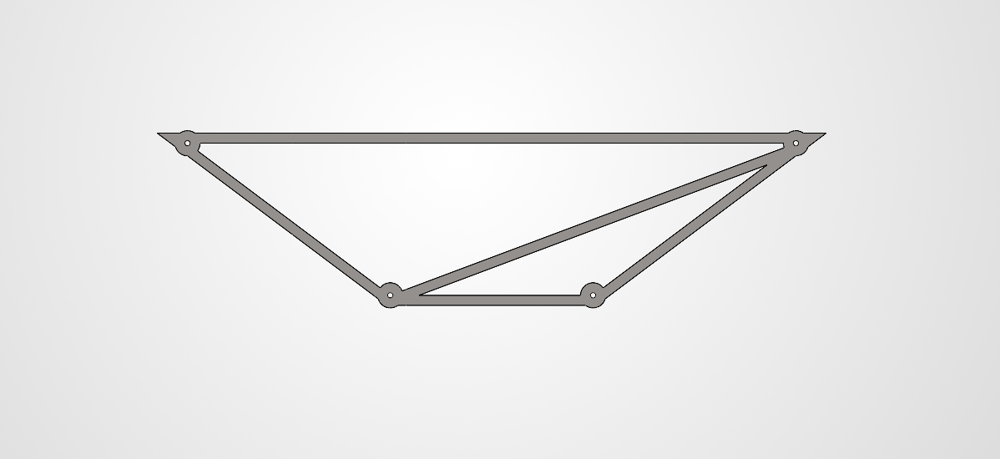
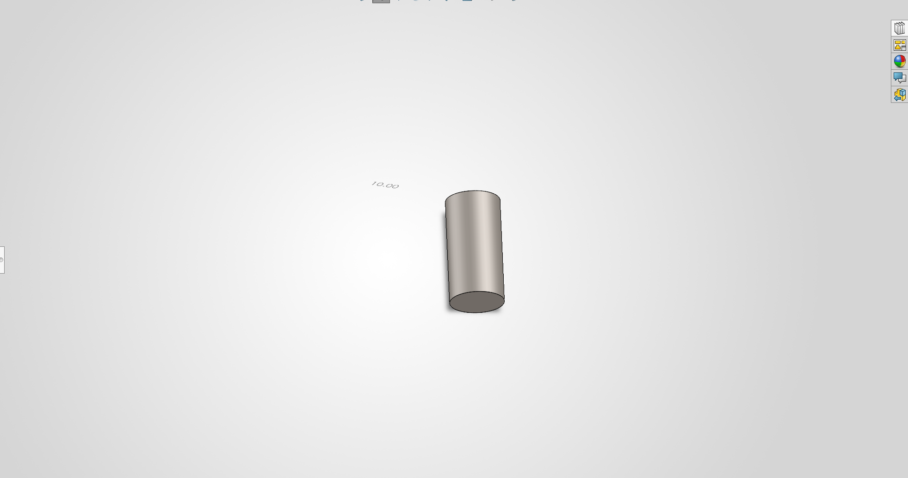
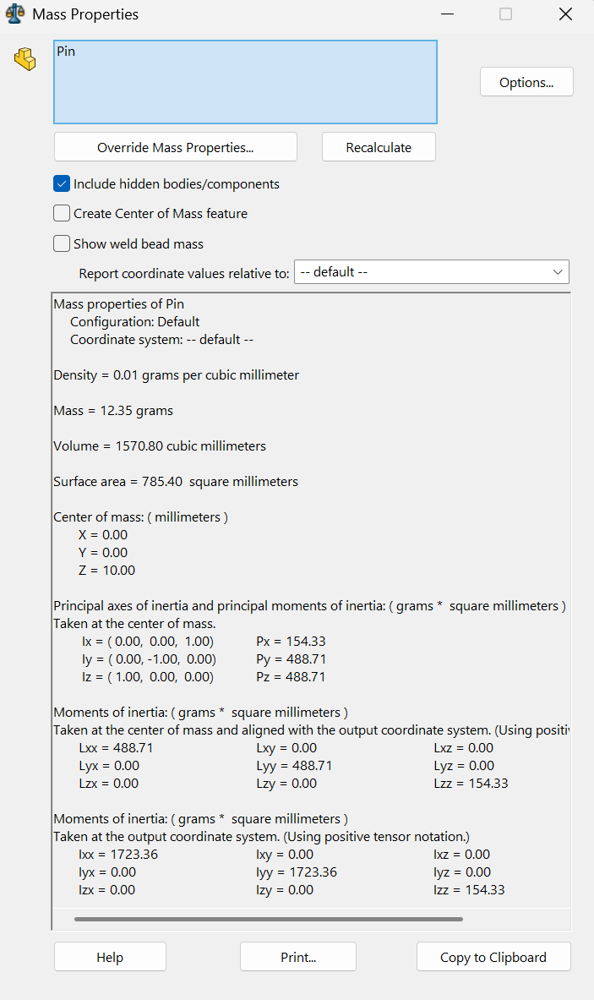

# A2 – Truss Stress Analysis

## Objective
The Objective for this assignment is to design a lightweight planar truss that supports the load and meets the specific geometric and material constraints. This design will use static equilibrium analysis to determine the internal forces in each truss member then stress analysis will be used to determine the required pin and member sizes using the factor of safety. After that, a CAD model will be created to verify the geometry and compare the predicted weight to the calculated weight. 

## Analyze
### Truss Geometry and Design Constraints

The Truss Geometry was designed to support the loads applied at point C and D while still staying within the dimensional constraints. The locations of points A, B, C, and D were determined using the dimensions a = 0.4m and b = 0.3m, and all members were connected to create a simple and stable truss. This Geometry will be used to calculate the internal forces throughout the truss as well as the length of each member. There is an applied load of P=20kn.  The 20KN force is applied upward at joint C and applied downward at joint D. 
### Truss Free-Body Diagram

A Free-body diagram of the entire truss was made to determine the reaction forces at support A and B. Support A is a pin support meaning it has 2 reaction forcers and support B is a rolling pin meaning it has 1 support force.  Using static equilibrium equations, I was able to find out that there was no horizontal force being applied at A Ax= 0.0kN and the vertical support of A is Ay= 6.67KN upward which is opposite of the B support force By= 6.67KN downward. These reaction forces where then used in methods of joints to figure out the forces applied at each joint. 
### Joint Free-Body Diagrams

Individual free body diagrams were then created for joints A, B, C, and D to find internal forces at each point. Member forces were initially assumed to be act in tension, with a positive result meaning tension and a negative result meaning compression. The method of joints and static equilibrium equations were used to solve member forces. Solving all the joint showed that our calculations maintained equalibrium throughout the entire truss.
### Internal Force Analysis 
The internal forces were found using the method of joints after the support forces were found. The resulting forces were AB= 8.89KN in tension, BC= 11.11KN in compression, CD= 26.67KN in tension, DA= 33.33KN in tension, and AC= 37.96 KN in compression. Member AC has the largest internal force and was selected as the critical member for determining minimum required cross-sectional area. First the symbolic relationships between load, geometry and member forces were obtained then numerical values were entered. 
### Member Cross-Section Analysis

The required member cross-sectional area was determined using the greatest internal force. Member AC is our critical member with the largest internal force of 37.96kn in compression. Using a safety factor of 3.5 and AISI 1020 yield strength of 351.57 MPa, the minimum cross-sectional area was calculated to be approximately 378mm^2. A practical cross-section of 20mm x 20mm was selected for the solid works model giving an actual member area of 400mm^2. This area is slightly larger than the calculated minimum and therefore satisfies the constrains while keeping a simple member geometry throughout.
### Truss weight analysis

The approximate weight was calculated using the 400mm^2 cross-sectional area, the total length of all 5 truss members and the density of AISI 1020 steel. The total length of member was found by adding member AB, BC, CD, DA and AC giving a total length of 3454.4mm. I then found the volume of the truss and multiplied it by the density of AISI 1020 steel which is 7900 kg/m^3 to find the mass. Once I found the mass gravity was applied to convert to weight. My total weight was 107N. This hand calculated value will later be compared to the solid works mass-property result.
### Pin Analysis

The connecting pins were designed for single shear using the largest joint reaction load in the truss. Joint C was selected as the critical pin location with a resultant sheer force of 20kn. A safety factor of 4 was applied with the specific hardened tool steel shear yield strength of 170ksi to determine the minimum required pin area and diameter. The minimum area was calculated to be 68.45mm^2 and the diameter 9.32mm. A practical pin of 10mm diameter was chosen, giving an actual area of 78.54mm^2, which exceeds the calculated minimum. Four identical pins were used for this design, each modeled at a length of 20mm.
## Decide
### Truss Geometry Selection
The final truss geometry was selected using a simple trapezoid using points A, B, C, and D with diagonal member AC. This layout was chosen because it satisfies the given constraints with keeping the number of members low which in return is keeping the weight down. Adding member AC stabilizes the four-sided frame by divinding it into 2 triangles without adding unnecessary members.  
### Member Cross-Section Selection
The minimum required cross-sectional area was calculated to be approximately 378mm^2. A 20mm x 20mm square cross section was selected for the final design, giving an actual area of 400mm^2. This size exceeds the calculated minimum, satisfies the required factor of safety, and provides uniform geometry that can be consistently modeled in SolidWorks. 
### Pin Size Selection
The minimum calculated pin diameter was 9.32mm based on the critical single-shear load at joint C. A 10 mm diameter pin was selected to provide a practical size that exceeds the calculated minimum while maintaining the required factor of safety. All four pins were modeled with the same diameter and a length of 20 mm to maintain consistency throughout the design.
## Communicate
### CAD Model

A 3D CAD model of the truss was created in solid works using the final geometry and dimensions from hand calculations. The truss modeled as a single part with all members using the 20mm x 20mm cross sectional area and the 4 pin locations were included at joints A, B, C, and D. The pins were modeled separately as 10mm diameter cylinders with a length of 20mm to match the calculated design.  
### Mass Properties and Weight Comparison

The solid works mass properties tool was used to determine the predicted mass of the completed truss and pins. The truss model has a mass of 11.492kg which corresponds to a weight of 112.7N. Each pin had a mass of approximately 12.35g making the combined pin weight 49.4g for all 4 pins. The hand calculated truss weight was approximate 107N, while the solid works predicted the weight to be 112.7N. The CAD result is slightly higher because the model includes additional material around the joint regions that was not represented in the hand calculations. This comparison shows the how a simplifies model can provide a close estimate while the CAD model captures more of the final geometry.   
### Engineering Lessons Learned 
One lesson that I learned from this project is that the member that carried the largest internal forces was not located where the largest external load is applied. The method of joints showed that member AC was under approximitly 37.96KN, even though the applied loads were only 20KN. This showed me how the angle that the member is set at can directly increase the forces that are transmitted through individual members. The comparison between the solidwords model and the hand calculated also demonstrates the limitations of simplified problem solving. This showed why analytical calculations are helpful for initial sizing while CAD can be used to provide a more accurate prediction once the final geomerty has been created.  
### Time Spent
The total time spent on this project was 10 hours. 
### CAD Files
The completed SolidWorks files for the truss and pin are provided below so that the final dimension, geometry, materials properties and mass properties can be reviewed. 
- [Download Truss SolidWorks Part](Truss.SLDPRT)
- [Download Pin SolidWorks Part](Pin.SLDPRT)

## MEGR 2157 - Failure Mode Analysis
### Truss Member Failure Modes
The truss members were made out from AISI 1020 Steel, which is considered to be a ductile material. The tension members from AB, CD, and DA would be expected to fail primarily by yielding as the applied load increases, rather than sudden brittle fracture. Members AC and BC are in compression, making buckling a possible failure mode, with AC being the highest axial stress at 94.9MPa, which is below the AISI 1020 yield strength of 351.57MPa and the allowable stress 100.45 MPa using the safety factor of 3.5. Therefore none of the members are expected to to fail under specfic loading. The likelihood of yielding could be reduced by increasing the member cross-sectional area, while the likelyhood of buckling in the compression members could be reduced by increasing thier stiffness or reducing thier unsupported length. 
### Pin Connection Failure Mode
The most likely failure mode for connecting pins is shear failure, since the pins transfer the load between the truss members through a singe sheer plane. The critical pin was identified at joint B where the resultant load is 20kn.Using a 10 mm diameter pin gives a shear area of 78.54mm^2, resulting in a shear stress of approximately 254.6MPa. This is below the allowable shear stress of approximately 293 Mpa, which was calculated from the specified 170 ksi shear yield strength and a factor of safety of 4. A larger pin diameter would reduce the shear stress and further decrease the likelihood of pin failure
### Sources
Mat Web: https://matweb.com/search/DataSheet.aspx?MatGUID=10b74ebc27344380ab16b1b69f1cffbb&

Prudue: https://www.purdue.edu/freeform/me323/wp-content/uploads/sites/2/2020/09/chapter03.pdf?

### AI Use 
Prompt: describe the failure of trusses members and pin connections
solutiion: For a typical pin-connected truss, failure can happen in either the truss members or the pin connections:

Truss Member Failure

Truss members primarily carry axial tension or compression.

Tension failure: A member is pulled apart when the tensile stress exceeds the material’s strength. It may yield, stretch, and eventually fracture.
Compression failure: A member can crush if the compressive stress is too high.
Buckling: Long, slender compression members may suddenly bend sideways and become unstable before the material itself crushes. Buckling is often the main concern for compression members.
Pin Connection Failure

Pins transfer forces between the truss members.

Pin shear: The pin can be sheared across its cross-section when the connection force becomes too large.
Bearing failure: The pin pushes against the side of the hole, causing the pin or member around the hole to deform/crush.
Tear-out: The material between the pin hole and the edge of the member can rip out.
Net-section tension failure: The hole reduces the member's cross-sectional area, so the member can fracture across the pin hole.

Simple summary:

Truss members generally fail by tension, crushing, or buckling, while pin connections generally fail by shear, bearing, tear-out, or fracture around the pin hole.

Follow up prompt: what are typical modifcations engineers use to get arround these issues
Follow up solition: Engineers typically modify the geometry, material, or connection design to prevent these failures.

Failure problem	Typical engineering modification
Tension failure	Increase the member's cross-sectional area or use a stronger material
Compression/crushing	Use a thicker/larger member or higher-strength material
Buckling	Use a larger cross-section, add bracing, shorten the unsupported length, or change the cross-sectional shape
Pin shear	Increase pin diameter, use a stronger pin, or design the connection for double shear
Bearing failure	Increase pin diameter or increase the thickness of the material around the pin
Tear-out at pin hole	Move the hole farther from the edge or increase the width/thickness of the member
Fracture across pin hole	Make the member wider around the hole or reinforce the connection area

A major one to remember for trusses is buckling. Engineers often don't just make a compression member thicker—they may use an I-section, tube, or other shape that increases its resistance to buckling without adding a huge amount of weight.

For pin connections, engineers commonly use gusset plates to spread the forces over a larger area and strengthen the joint.
