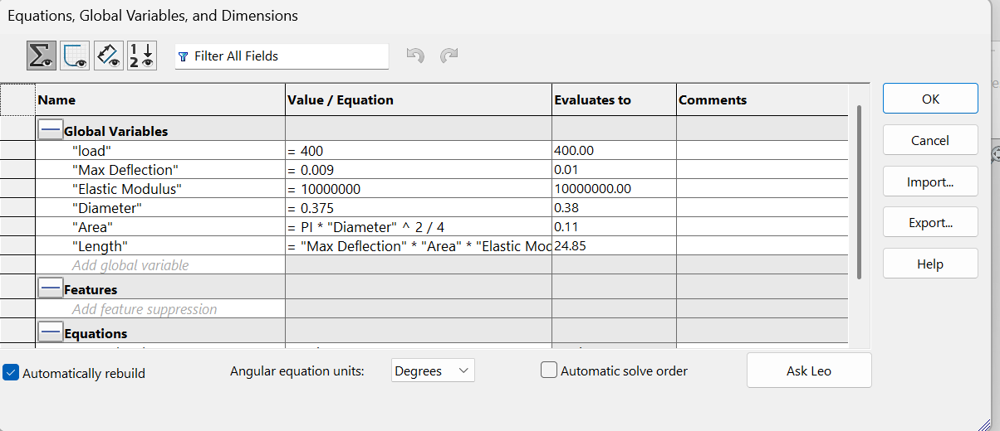
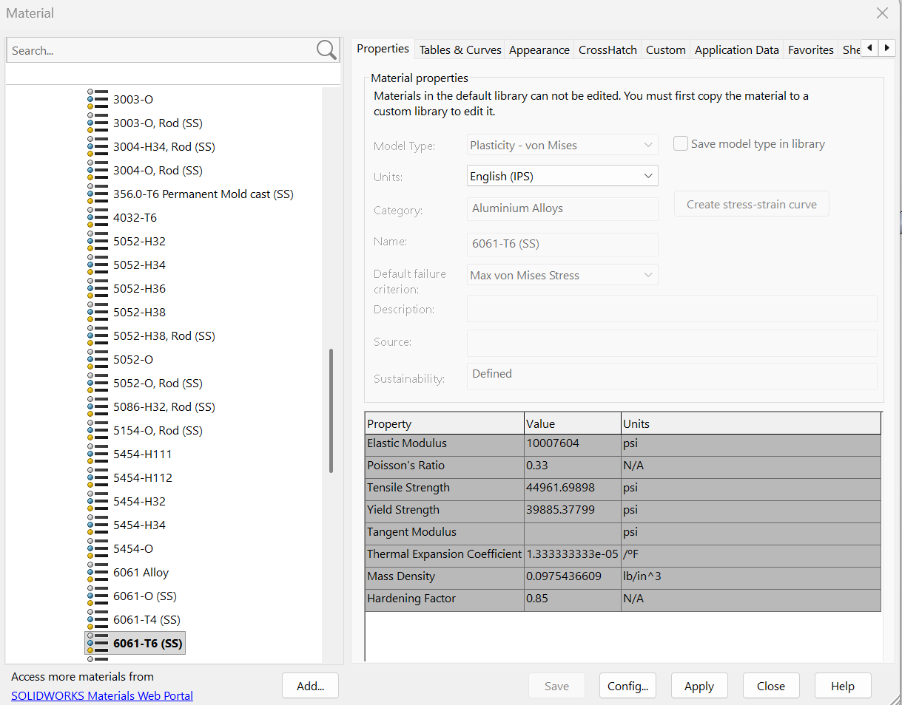
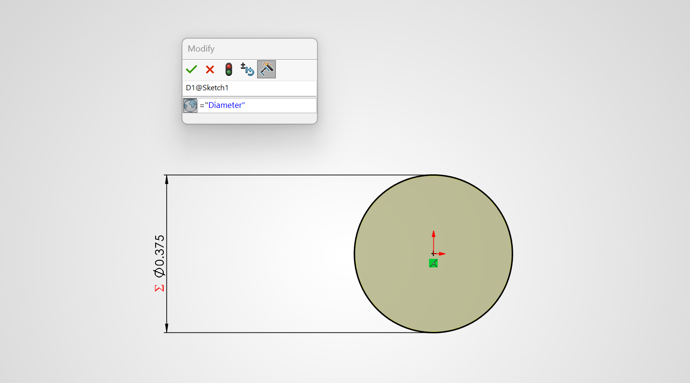
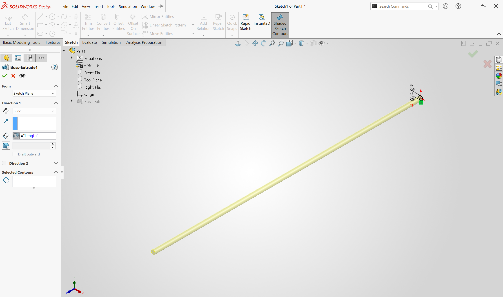

# A3 – Parametric Design and FEA

## Objective
The objective of this assignment is to parametrically design an aluminum beam with a circular cross section that meets our maximum axial deflection of 0.009in under our applied load. We will use the relationship between material properties, length, and cross-sectional area will be used to find the geometry of the beam. 

## Analyze

### Design Requirements

The bar was designed according to the following requirements:

-Direct Tensile loading between 300 and 500 lbf
-Aluminum material
-Maximum axial deflection of 0.009 in
-Young's modulus between 8.5 x 10^6 and ll.5 x 10^6 psi
-Circular cross section
-Geometry controlled parametically in solidworks
-Yield strength of approximately 40 ksi

For the final design, a tensile load of 400 lbf and a diameter of 0.375 in were selected. 

### Cross-section selection

A circular cross section was selected for the bar as specified by the design requirements. The diameter was defined as a global variable in SolidWorks so that changes to the diameter would automatically update the cross-sectional area and calculated bar length. 

### Axial Deflection Analysis 

The axial deflection of the bar was determined using the direct tension elongation equation found in our Machinery's handbook:

δ = FL / AE

where F is the applied tensile load, L is the bar length, A is the cross-sectional area, and E is Young's modulus.

The equation was rearranged to solve for the allowable bar length 

L = δAE / F

Using a maximum deflection of 0.009 in, a load of 400 lbf, a diameter of 0.375 in, and an elastic modulus of 10.0 x 10^6 psi, the calculated bar length was approximatley 24.85 in.

### Parametric Equations 

Global variables and equations was created in SolidWorks so that the geometry would automatically update when a design parameter was changed. 

The primary global variables were:

-Load = 400lbf
-Maximum Deflection = 0.009 in
-Diameter = 0.375 in 
-Elastic Modulus = 10.0 x 10^6 psi

The cross-sectional area was defined parametrically as:

A= πd^2 /4

The bar length was controlled by: 

L= δAE / F

This produced a baseline bar length of approximately 24.85 in. Because the dimensions were equation-driven, changing the load or diameter automatically recalculated the require bar length.  
## Decide

### Material Selection

6061-T6 aluminum was selected as the material for the bar. This material satisfies the assignment requirement for an aluminum material with a Young's modulus between 8.5 x 10^6 and 11.5 x 10^6 psi. 

According to the SolidWorks material library, 6061-T6 aluminum has the following properties:

-Elastic Modulus = 10,007,604 psi
-Tensile strength - 44,961.70 psi
-Poisson's Ratio = 0.33
-Yield Strength = 39,885.38 psi

An elastic modulus of 10.0 x 10^6 psi was used for the parametric deign calculations. This is within the required range and is very close to the SolidWorks material value. 

The assignment specfices a yield strength of approximately 40 ksi, which is consistent with the solidworks value of 39.89 ksi.
### Bar Geometry Selection

A diameter of 0.375 in was selected for the initial design. Using the circular cross-sectional area and axial deflection equation, the required length of the bar was calculated to be approximately 24.85 in.

Both diameter and length were controlled using SolidWorks global variables. The final geometry was therefore a 0.375 in diameter and 24.85 in long circular bar.
## Communicate

### Parametric CAD Model

The CAD model was created in SolidWorks using an extruded boss of a circular sketch. Rather than entering in set dimensions, the diameter was linked to the diameter global variable, and the extrusion depth was linked to the calculated length global variable. This allows the physical geometry model to automatically updated whenever the variables are changed. 
### Finite Element Analysis Setup

A static finite element analysis was performed in solidworks simulation to veerify the theoretical design. The 6061-T6 aluminum material was applied to the model. One circular end of the bar was fixed, while a 400 lbf tensile force was applied normal to the opposite end face. The bar was then meshed and the static study was solved. The simulation was used to determine the maximum displaement and von Mises stress of the bar.
### Deflection Map
The displacement results from the SolidWorks FEA showed a maximum resultant displacement of 0.008993 in. The theoretical design was created for a maximum allowable displacement of 0.009 in. Therefore, the FEA result remained within the specific deflection limit and was extremely close to the theoretical prediction.

Maximum FEA displacement = 0.008993 in

Allowable displacement = 0.009 in
### Von Mises Stress Map

The von Mises stress plot was used to evaluate the stress developed in the bar under our applied 400 lbf tensile load. The SolidWorks simulation produced a maximum von Mises stress of 3.843 ksi. This value is significantly below the approximately 40 ksi yield strength of the 6061-T6 aluminum used in the model.

Maximum von Mises stress = 3.843 ksi

Yield strength = 39.89 ksi

### Safety Factor 

The factor of safety was calculated by comparing the material yield strength to the maximum von Mises stress obtained from the FEA.

n = Sy / σmax

n = 39.89 ksi / 3.843 ksi

n = 10.38

The resulting factor of safety is 10.38. Therefore, the bar remains well below the yield strength of the material under the applied 400 lbf tensile load. 

### Hand Calculations vs. FEA 

The theoretical calculations predicted an axial deflection of 0.00900 in. The SolidWorks finite element analysis produced a maximum displacement of 0.008993 in.

The percent difference was calculated using: 

Percent Difference = [FEA - Hand Calculation] / Hand Calculation x 100

Percent Difference = [0.008993 - 0.009000] / 0.00900 x 100

Percent Difference = 0.078%

The extremely small percent difference shows that the FEA result closely agrees with the theoretical calculation. The small difference is likely due to the SolidWorks material model using an elastic modulus of 10,007,604 psi, while the hand calculations used 10,000,000 psi. I would trust the result in the FEA slightly more because it used the specfic material properties assinged to the solidworks model. However the close spread between the two results verifies that the theoretical and FEA model are consistent. 
### Pin hole Stress Concentration 

A pin hole in a tensile member creates a stress concentration around the hole. For this analysis, a stress concentration factor of approximately Kt = 3.0 was used for a circular hole in tension.

Using the nominal axial stress: 

σnom = F/A

σnom = 400lbf / 0.11045 in^2

σnom = 3.622 ksi

The estimated maximum stress around the pin hole was calculated using 
### Engineering lessons learned 

### Mistakes Made

### Time Spent

### CAD Files

## MEGR 2157 - Modify Design Parameters

### Load Modification 

### Diameter Modification 

### Parameter Study Results

### AI Use 

