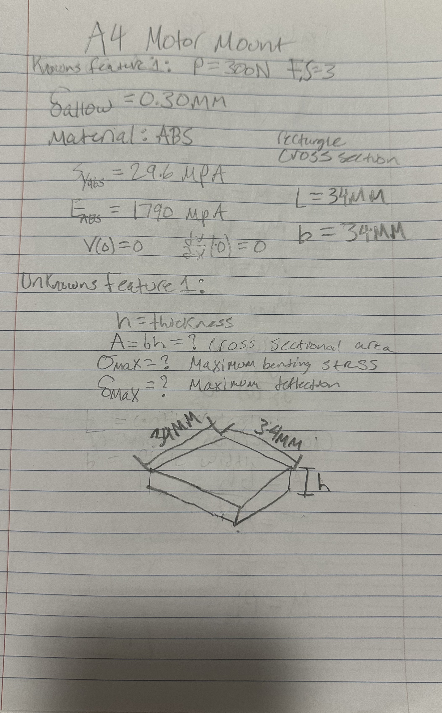
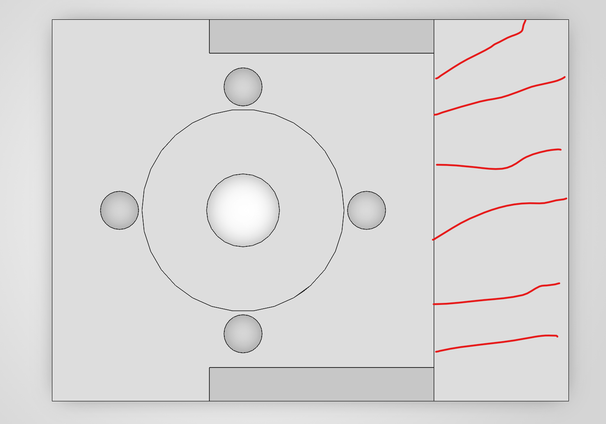
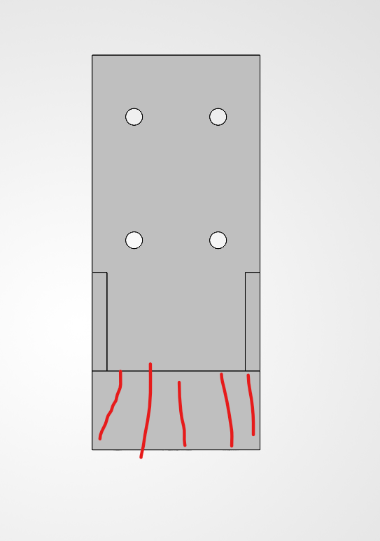
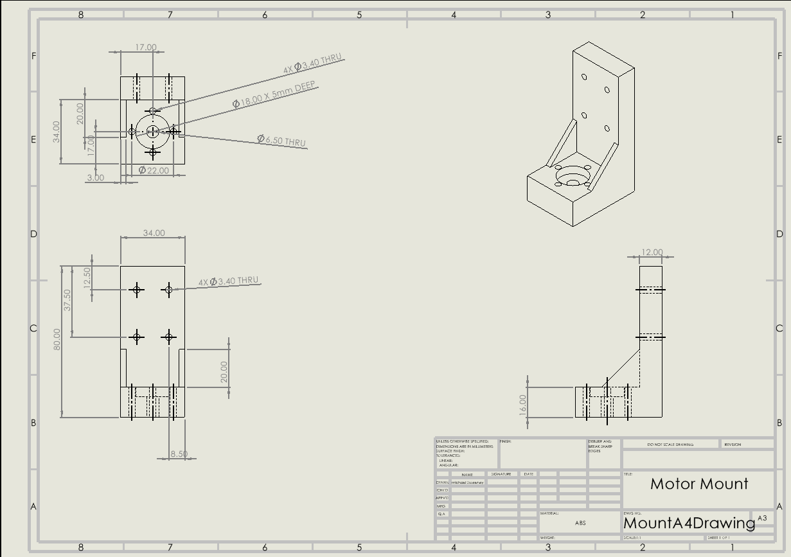

# A4 – Motor Mount Design

## Objective
The objective of this assignment was to design a motor mount for the specid 24 V DC gear motor. The mount is made up of 2 separate features which were both analyzed using beam bending equations for both deflection and stress. The final design was modeled in solidworks using the ABS material and included motor mounting holes, wall mounting holes and my added gussets to reduce deflection. 

## Analyze

### Design Requirements
The motor mount was designed around this 24 V DC gear motor with the load conditions specified in the picture. The applied load was 300N and had a required factor of safety of 3. The maximum allowable deflection for both features was defined as 0.30mm. I selected ABS as the material (couldn't find the other materials) and use the lower end of both the Young's Modulus and the yield strength. The values used were 1.79 GPa for Young's Modulus and 29.6 MPa for yield strength. The mount also had to include the clearance for the motor shaft and mounting bolts. The mounting hole clearance for M3 bolts was designed at 3.4mm.

### Feature 1 Analysis
Feature 1 was modeled as a cantilever beam that supports the motor. The loading was represented by the applied bending moment show in in Appendix B. The feature was analyzed for both bending stress and maximum deflection to find the required cross-sectional area.

#### Known and Unknown Values
The known and unknow values used for feature 1 are show in my notebook calculations below. The analysis used a 300 N applied load, factor of safety of 3, and a maximum allowable deflection of 0.30 mm, and the material selected was ABS. A length and width of 34 mm was used for feature 1. 

#### Feature 1 Free-Body Diagram
The free body diagram below shows Feature 1 modeled as a cantilever beam with the applied moment PL and the opposing reaction moment at the fixed connection.

#### Bending Stress Analysis
The beam bending equation was used to determine the minimum thickness required to satisfy our stress requirements. The symbolic and numerical calculations are show below.

The calculated minimum thickness based on bending was 13.51 mm. 

#### Deflection Analysis
The bean deflection equation was used to determine the minimum thickness required to keep the maximum deflection below 0.30 mm. The symbolic and numerical calculations are shown below.

The calculated minimum thickness based on deflection was 15.71 mm. 

#### Feature 1 Cross-Section Selection
The deflection analysis produced a larger minimum thickness and therefore is the controlling dimension for feature 1. The calculated 15.71 mm was rounded up to a final thickness of 16 mm for ease of calculation and design. 

### Feature 2 Analysis
Feature 2 was modeled as the wall mounted portion of our motor mount. The lower 25mm was treated as free to bend section while the upper portion was supported by the rigid wall. The feature was analyzed for both the bending stress and maximum deflection to find the required cross-sectional area. 

#### Known and Unknown Values
The known and unknown values used for feature 2 are shown in my notebook calculation below. The analysis used a 300 N applied load, factor of safety of 3, and a maximum allowable deflection of 0.30 mm, and the material selected was ABS. The feature 2 width was 34mm, and the free to bend length used was 25 mm.

#### Feature 2 Free-Body Diagram
The free body diagram below shows feature 2 with the applied moment PLd acting on the free to bend portion that has an opposite reaction moment at the wall supported section.

#### Bending Stress Analysis
The beam bending equation was used to determine the minimum thickness required to satisfy our stress requirements. The symbolic and numerical calculations are show below.

  

The calculated minimum thickness based on bending stress was 11.58 mm.

#### Deflection Analysis
The bean deflection equation was used to determine the minimum thickness required to keep the maximum deflection below 0.30 mm. The symbolic and numerical calculations are shown below.

The calculated minimum thickness based on deflection was 11.55 mm. 

#### Feature 2 Cross-Section Selection
The stress requirement produced a slightly larger minimum thickness and therefore controlled our feature 2 thickness. The calculated thickness 11.58 mm was rounded to 12 mm for ease of calculations and design.

The final feature 12 geometry used in my SolidWorks model was 34 mm wide x 12 mm thickness, with an overall height of 80 mm.
## Decide

### Material Selection
ABS was selected as the material for the motor mount. The lower reported values for the material properties were used in the calculations to keep the design conservative. The values used were 1.79 GPa for Young's Modulus and 29.6 MPa for yield strength. 

### Motor Mount Geometry Selection
The final motor mount geometry was selected based on the stress and deflection calculations for each feature. 
Feature 1 final dimensions: 34 mm wide, 34 mm long, 16 mmm thick.
Feature 2 final dimensions: 34 mm wide, 80 mm overall height, 12 mm thick

## Communicate

### Parametric CAD Model
The motor mount was modeled in SolidWorks using parametric modeling techniques. Global variables were used in the major design dimensions so that geometry could easily be changed if the design values changed. The variables controlled the main dimensions of feature 1, feature 2, and the gussets.

### Final CAD Model
The final CAD model combined feature 1 and feature 2 into a single motor mount. The model included the motor shaft clearance, motor mounting holes, wall mounting holes, and my added gussets added at the inside corners to increase stiffness.

### Deflection Reduction Features
Two triangular gussets were added between feature 1 and feature 2 to reduce deflection at the inside corner of either side of the mount. Each gusset has a thickness of 3 mm. These gussets help increase the stiffness of the connection between the horizontal and vertical features. 

### Motor Mounting Features
Feature 1 included the required geometry for mounting the motor. The design included a center shaft clearance hole, a larger locating indentation for the raised motor boss, and four clearance holes for the M3 mounting bolts. The motor mounting features included a 6.5 mm diameter for the shaft clearance hole, an 18.0 mm diameter for the locating indentation and then 4x 3.4 mm diameter M3 clearance holes.

### Wall Mounting Features
Feature 2 included four clearance holes for mounting the motor mount to the rigid wall. Each wall mounting hole had a diameter of 3.4 mm. The holes were placed symmetrically within the wall support region of feature 2. 

## MEGR 2157 – Engineering Drawing

### Multiview Drawing
A Multiview drawing was created from the completed SolidWorks model. The drawing includes the front view, top view, right side view and an isometric view. The drawing includes dimensions required to manufacture the part without referencing  the 3D CAD model. Overall dimensions, hole locations, hole callouts, hidden lines, centerlines and center marks were all added. The drawing also includes the material, scale and part name in the title block. 

## Engineering Lessons Learned
This project showed how beam bending equations can be used to design a real component rather than just solving for stress or deflection after the geometry is already known. Feature 1 was controlled by deflection while feature 2 was controlled by bending stress. This showed that both requirements need to checked to find the controlling condition because it can change depending on geometry.  

This project also let me think about different ways to improve the stiffness of areas that are likely to bend. 

## Mistakes Made / Design Changes
One of the main changes made during the design process was separating the motor mount into 2 features. I separated feature 1 to include only the 34mm x 34mm square and let feature 2 be the full vertical piece. I changed this so that it was easier to determine the correct length for the deflection and stress analysis of the free to bend section. These changes made the final model better match the actual motor geometry. 

## Time Spent
I spent approximately 7-8 hours on this assignment.

## CAD Files

[Download SolidWorks Motor Mount Part](Mount4A.SLDPRT)

[Download SolidWorks Engineering Drawing](MountA4Drawing.SLDDRW)

## AI Use
